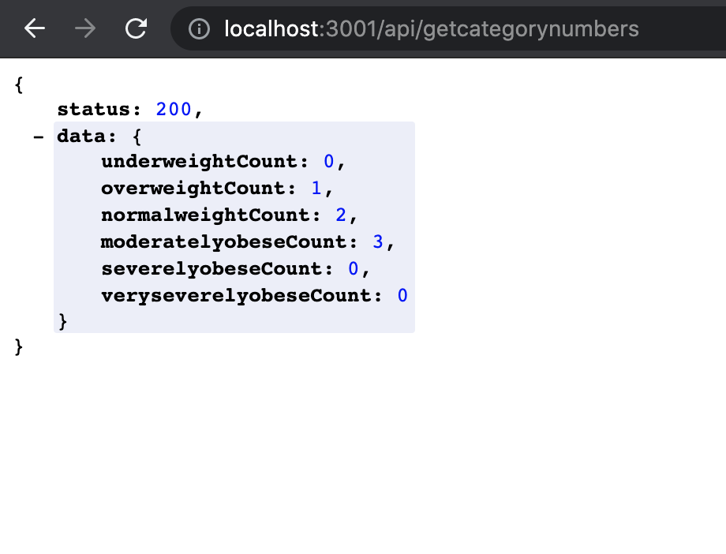

# BMI Calculator
## About the App
- I have develpoed an API which provides bmi Data of patients when get request on localhost:3001/api/getbmidata is made.
- It also provides with number of patients in each category (underweightCount, overweightCount, normalweightCount, moderatelyobeseCount, severelyobeseCount, veryseverelyobeseCount ) when get request on localhost:3001/api/getcategorynumbers is made.
- API endpoint is 'localhost:3001/'.
## Technologies used
- Node.js.
- Express.js.
- JavaScript.
- Mocha, Chai and Sinon for writing tests.
## Requirements
- Node.js v10 or higher must be installed to run this program.
## Usage
- clone the master branch and delete node_modules and package-lock.json
- then on terminal navigate into the folder and do **'npm i'**.
- 
- start the server by typing **'npm run server'**.
- 
- go to browser and type **'localhost:3001/api/getbmidata'** to get bmi data.
- 
- go to browser and type **'localhost:3001/api/getcategorynumbers'** to get category counts.
- 
## Tests
- navigate to the cloned folder.
- type **'npm test'** on the terminal to run test files.
